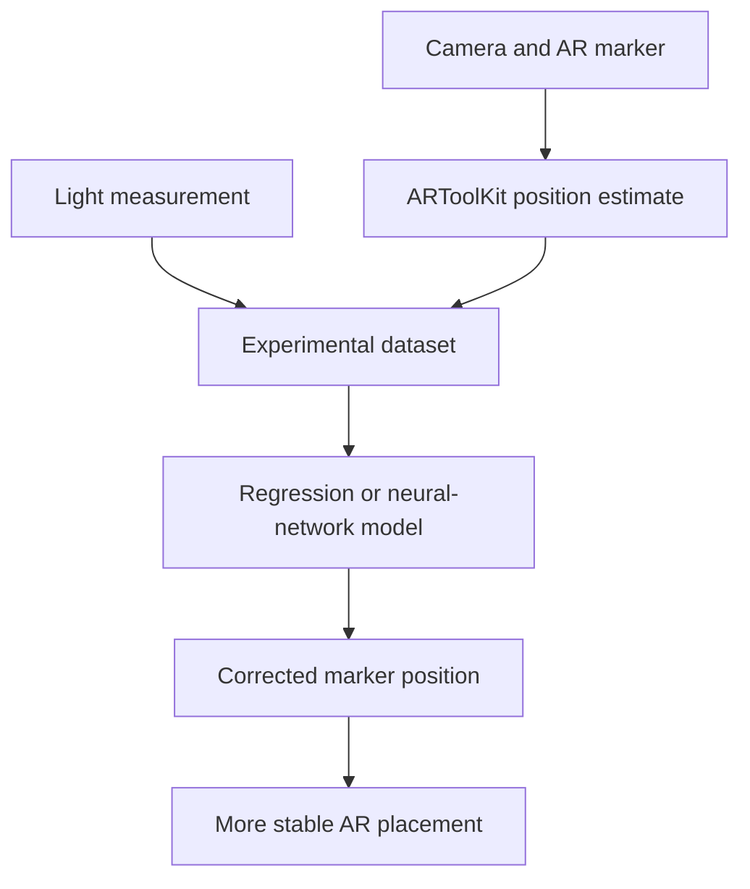

# AR Marker Position Estimation under Dynamic Lighting

A research project for improving augmented-reality marker tracking in semi-controlled environments where lighting conditions change dynamically. The proposed method combines illumination measurements, ARToolKit position estimates, and machine-learning regression to reduce tracking error and improve the stability of virtual-object placement.

The experimental model fitted laboratory data with a reported accuracy of **99%**.

## Research Problem

Marker-based augmented-reality systems estimate a marker's position and pose relative to a camera so that virtual objects can be placed correctly in the real scene. These estimates are sensitive to environmental conditions—particularly changes in illumination—which can introduce position error and visible jitter.

This project investigates whether light measurements can be incorporated into a predictive model to improve marker-position estimation when the environment cannot be fully controlled.

## Proposed Method

The approach combines measurements from an augmented-reality tracking system with information about the surrounding light level.



The research workflow includes:

1. Calibrating the Kinect and camera setup.
2. Detecting the AR marker and recording its estimated coordinates.
3. Measuring illumination under changing lighting conditions.
4. Building datasets that combine light and position information.
5. Training regression and neural-network models.
6. Evaluating prediction error across different light ranges.

## Implemented Approaches

### Kinect and ARToolKit

[`Kinect-ARToolKit-approach/`](Kinect-ARToolKit-approach/)

The computer-vision component contains camera-calibration utilities and a Kinect/ARToolKit sample application. It supports marker detection, camera-coordinate estimation, Kinect input, hand and user detection, and visualization of augmented objects.

Main technologies:

- C and C++
- ARToolKit
- Microsoft Kinect
- OpenNI and NITE
- OpenGL
- Visual Studio project files

### Multiple Regression

[`multiple_regression_appraoch/`](multiple_regression_appraoch/)

This component represents the statistical regression approach used to model the relationship between illumination and marker-position error. The repository includes the compiled .NET application, configuration files, spreadsheets, and numerical-library dependencies used by the experiment.

Main technologies:

- C# and .NET Framework 4.5.2
- Math.NET Numerics
- Microsoft Excel interoperability
- Multiple regression

> The directory name `multiple_regression_appraoch` is preserved because it matches the repository. The original C# source file referenced by its project configuration is not currently included.

### Neural Networks

[`neural_network_approach/`](neural_network_approach/)

The neural-network implementation supports alternative learning strategies and experimental evaluation across configurable lighting ranges.

Included capabilities:

- Perceptron learning
- Resilient backpropagation
- Deep and normalized deep-learning experiments
- Custom activation functions
- Training, validation, and testing splits
- K-fold cross-validation
- Data normalization and transformation
- Error analysis and result visualization
- Network serialization

Main technologies:

- C# and .NET Framework 4.5
- Accord.NET
- AForge.NET
- Math.NET Numerics
- ZedGraph
- ExcelDataReader and LinqToExcel

## Research Outputs

- [Journal article: *Marker's position estimation under uncontrolled environment for augmented reality*](Journal-Marker%E2%80%99s%20position%20estimation%20under%20uncontrolled%20environment%20for%20augmented%20reality.pdf)
- [Doctoral thesis: *Prediction of AR marker's position: A case study using regression analysis with Machine Learning method*](Thesis-Marker%E2%80%99s%20position%20estimation%20under%20uncontrolled%20environment%20for%20augmented%20reality.pdf)
- Published article DOI: [10.1007/s12008-016-0356-x](https://doi.org/10.1007/s12008-016-0356-x)

## Key Result

The regression-based approach improved marker-position estimation under dynamically changing illumination. Experimental data collected in a laboratory setting were fitted with a reported accuracy of **99%**, demonstrating that incorporating light measurements can improve the reliability of marker-based AR tracking.

## Technologies

- **Languages:** C#, C, C++
- **Machine learning:** Regression, neural networks, cross-validation
- **Computer vision and AR:** ARToolKit, Kinect, OpenNI, NITE
- **Numerical computing:** Accord.NET, AForge.NET, Math.NET Numerics
- **Visualization:** OpenGL, ZedGraph
- **Data handling:** CSV, Excel, ExcelDataReader, LinqToExcel
- **Development environment:** Visual Studio and .NET Framework

## Project Structure

```text
Marker-s-position-estimation.../
├── Kinect-ARToolKit-approach/
│   └── Camera calibration and Kinect/ARToolKit tracking
│
├── multiple_regression_appraoch/
│   └── Regression executable, spreadsheets, and project configuration
│
├── neural_network_approach/
│   └── Neural-network training and evaluation source code
│
├── Journal-Marker’s position estimation...pdf
│   └── Published journal article
│
├── Thesis-Marker’s position estimation...pdf
│   └── Doctoral dissertation
│
└── README.md
```

## Running the Project

### Prerequisites

The code was developed with legacy Windows and .NET tooling. Reproducing the original environment may require:

- Windows
- Visual Studio with .NET Framework 4.5/4.5.2 support
- NuGet package restoration
- Microsoft Kinect SDK and compatible Kinect hardware
- ARToolKit
- OpenNI and NITE
- OpenGL development libraries
- Microsoft Excel or an alternative data-import workflow

### Neural-network component

1. Open `neural_network_approach/xamarin_neural_network.sln` in Visual Studio.
2. Restore the NuGet dependencies listed in `packages.config`.
3. Replace machine-specific assembly paths in the project file with valid local package references.
4. Add the experimental CSV files expected by `Program.cs` to the appropriate `Data` directory.
5. Configure the light range, dataset, delimiter, and learning approach in `Program.cs`.
6. Build and run the solution.

### Kinect/ARToolKit component

1. Install the required Kinect, OpenNI, NITE, ARToolKit, and OpenGL dependencies.
2. Open the relevant Visual Studio solution inside `Kinect-ARToolKit-approach`.
3. Update include, library, camera, and calibration paths for the local environment.
4. Calibrate the camera before running the tracking sample.

> The repository contains legacy project files, compiled artifacts, and machine-specific dependency paths. It is best treated as a research archive unless those dependencies and paths are modernized.

## Skills Demonstrated

- Designing controlled experiments for computer-vision research
- Collecting and analyzing sensor and tracking data
- Applying regression analysis to marker-position correction
- Developing and validating neural-network models
- Evaluating performance across changing environmental conditions
- Integrating cameras, Kinect sensors, and ARToolKit
- Implementing cross-validation and error analysis
- Translating research results into manufacturing and AR applications
- Documenting research through a doctoral thesis and peer-reviewed publication

## Authors and Publication

The journal article was authored by **Yazmin S. Villegas-Hernandez** and **Federico Guedea-Elizalde** at Tecnológico de Monterrey and published in the *International Journal on Interactive Design and Manufacturing*.

Repository author:<br>
**Yazmin Villegas**<br>
Data Scientist | Industrial and Systems Engineer<br>
[GitHub](https://github.com/AI-YAZMIN-VILLEGAS)
